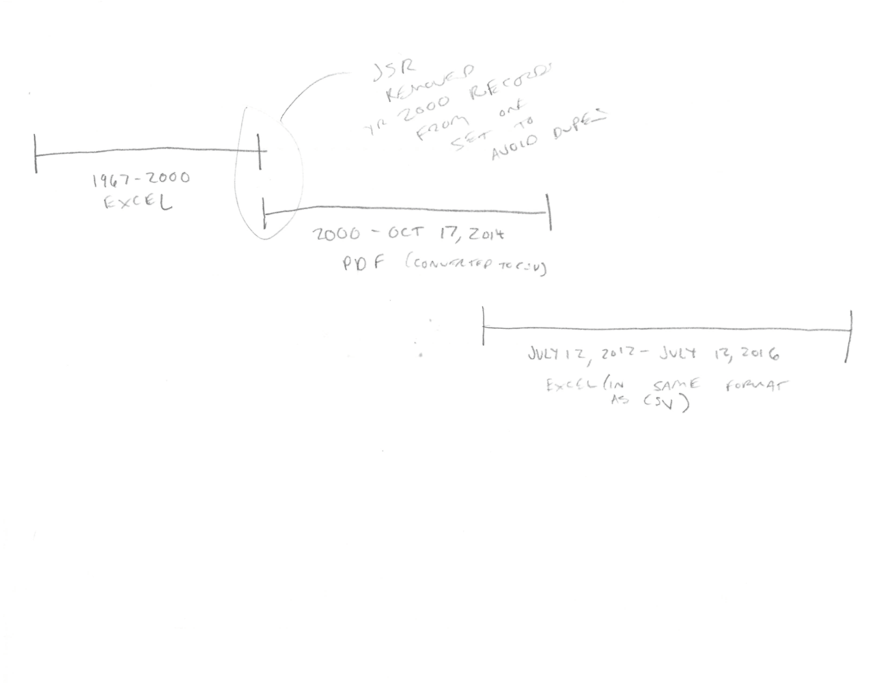
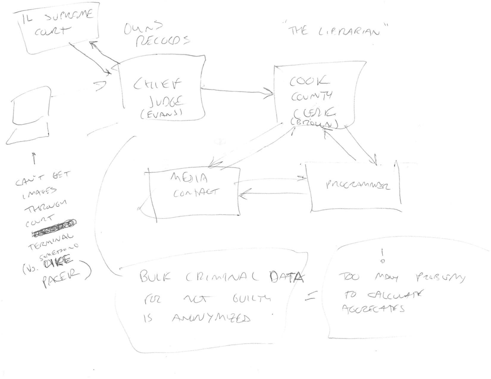

Tools for data and visual journalism
====================================

Notes for a workshop presented to the City Bureau, November 9, 2016.

FYI, you can find this document at https://github.com/ghing/tools-for-visual-data-journalism

Consider this a work in progress.

I'm talking about 3 tools. Here's a [list of many tools](http://keshif.me/demo/VisTools). It was made by [@adilyalcin](https://twitter.com/adilyalcin).

Before we start
---------------

1. Make sure you have a Google Account and can log into Google Spreadsheets.  Make a copy of [this spreadsheet](https://docs.google.com/spreadsheets/d/19E_wJdg3wqVrmj0x_fI2Y81WjBt0DZQX5WVHXVJ__gs/edit) in your own account.
2. [Sign up](https://carto.com/signup) for a Carto account if you don't already have one. It's free!

"data journalism"
-----------------

These are my definitions, and they're fluid.

Data journalism = journalism based on a quantitative analysis of records, documents or other information about events.

Data could be:

* [Crime incident reports fromt he city data portal](https://data.cityofchicago.org/Public-Safety/Crimes-2001-to-present/ijzp-q8t2)
* [Satelite imagery of estate lawns](https://www.revealnews.org/article/who-is-the-wet-prince-of-bel-air-here-are-the-likely-culprits/)
* [Details of police shooting victims hand-entered from news reports](https://www.washingtonpost.com/policeshootings/)
* What are your examples of data?

The journalism from it could look like ...

Maps and charts

From [Citizens Police Data Project](https://cpdb.co/data/AQj3yD/citizens-police-data-project).

From 

A line in a print story

From [Over 125K complaints against more than 25K Chicago cops](http://www.chicagotribune.com/news/watchdog/ct-chicago-police-complaints-met-20161013-story.html).

A virtual reality experience

From [Discovering Gale Crater](http://graphics.latimes.com/mars-gale-crater-vr/).

What are your examples of journalism rendered from data?

Other terms: data-driven journalism, precision journalism

"visual journalism"
-------------------

"visual journalism" = stories, or parts of stories, told primarily through perceiving sensory dimensions, rather than words and language

Again, this could look like maps and charts

From [Citizens Police Data Project](https://cpdb.co/data/AQj3yD/citizens-police-data-project).

But what about ...

From [In the Chicago Police Department, If the Bosses Say It Didn’t Happen, It Didn’t Happen](https://theintercept.com/2016/10/06/in-the-chicago-police-department-if-the-bosses-say-it-didnt-happen-it-didnt-happen/).

Or ...

<iframe src="https://player.vimeo.com/video/118358642" width="640" height="360" frameborder="0" webkitallowfullscreen mozallowfullscreen allowfullscreen></iframe>

From [Two Trains: Sonification of Income Inequality on the NYC Subway](https://datadrivendj.com/tracks/subway)

We'll focus on tools that sit in the intersection of data and visual journalism.

Tasks before tools
------------------

So today we're going to talk about journalism tools. But, often the way we're taught and learn tools is as a series of steps.  We can memorize these steps, but they don't always translate to different tools.  Memorizing steps also doesn't let us think critically about whether a tool is getting the job done.  In the case of journalism this means telling part of our story.

Instead, I want to focus on data and visual journalism tasks rather than specific tools, though we'll get to try out a few tools. When I present a tool, I'll try to offer alternatives that provide different ways to accomplish the same tasks. 

Should I use this tool?
-----------------------

* Can it do the task that I need to complete?
* Can I learn to use the tool in the time I have?
* Can I afford/access the tool?
* Can the output of the tool work with other tools?
 
Iterate
-------

Often it's easy to think of tools that visualize data as things we employ in the final steps of producing a piece of journalism.  This is wrong.  I want to encourage you to try out the tools we'll talk about today at every step of reporting.  We'll focus on getting meaning from these visuals rather than their elegance.  We can always polish the visuals later.  Visualizing data early helps you think about what your reporting in different ways. It also tests different visual forms.  If a particular form isn't helpful to you as you're reporting, it probably won't be helpful to your audience either.

Why these tools?
----------------

I wanted to pick tools that:

* Run in the browser (so it's more likely that they will run on both Mac OS and Windows) and don't have any software installation
* Free/low-cost
* Support a workflow that can be used in more sophisticated tools

Task: quickly organize and summarize information
------------------------------------------------

Tool: pencil and paper 

This is data journalism:

<blockquote class="twitter-tweet" data-lang="en">
Still possible it all went to <a href="https://twitter.com/NaturalHigh">@NaturalHigh</a>, which hasn&#39;t returned my many calls. If they got tens of millions, the name makes total sense. <a href="https://t.co/AWBryWCTMY">pic.twitter.com/AWBryWCTMY</a>
&mdash; David Fahrenthold (@Fahrenthold) <a href="https://twitter.com/Fahrenthold/status/794290800498802689">November 3, 2016</a></blockquote>

### Excercise

Time: 5 minutes

Think of a concept, person, system, ??? from your reporting.  Represent it visually on paper.

Here's some sketches I made to try to more clearly understand some recent work.

Three different time periods and formats of the same kind of data:

The relationship between different entities that control court records:

Task: group and compare numbers
-------------------------------

Tool: Google spreadsheets 

### About the data

This is a slice of [business license data](https://data.cityofchicago.org/Community-Economic-Development/Business-Licenses/r5kz-chrr) from the City of Chicago's data portal.  I [filtered it](https://data.cityofchicago.org/Community-Economic-Development/Chicago-Avenue-Business-Licenses-block-5600-5900/4u9x-fm3y) to businesses with licenses between the 5600-5900 block of W. Chicago Ave.

Here's the data [as a Google Spreadsheet](https://docs.google.com/spreadsheets/d/19E_wJdg3wqVrmj0x_fI2Y81WjBt0DZQX5WVHXVJ__gs/edit).

### Our workflow

1. Cut the data - select only the columns we care about
2. Filter the data - select only the rows we care about
3. Group the data and aggregate
4. Create a chart
5. Export the chart

### Hints

You can even use [SVG Crowbar](http://nytimes.github.io/svg-crowbar/) to download the chart as an SVG which you can edit in Adobe Illustrator. 

### Questions

* What story does the chart tell?
* Why did you choose the chart form?
* Did you see anything that made you say "wat?!?!"
* What new questions do you have?

### Other tools

* R + ggplot2
* Python + Pandas + seaborn
* Tableau
* Excel
* LibreOffice calc

Task: Examine spatial trends
----------------------------

Tool: Carto

### Our workflow

1. Cut the data - select only the columns we care about
2. Filter the data - select only the rows we care about
3. Export the data as CSV
4. Create a new dataset from the CSV
5. Create a new map from the dataset
6. Select data for the popups
7. Style map markers

### Hints

To cut the data, you can just copy and paste.  No shame! If you do this, use "paste values" for safety/

You also might want to check out the QUERY function, e.g.:

    =QUERY(Business_Licenses!A:AG,"SELECT E, AF, AG")

When filtering data, you can also just copy and paste.  You might also want to check out the UNIQUE function.

### What's that code?

The code we used to style map marker is looks something like this:

    #table_29{
      marker-fill-opacity: 0.9;
      marker-line-color: #FFF;
      marker-line-width: 1;
      marker-line-opacity: 1;
      marker-placement: point;
      marker-type: ellipse;
      marker-width: 10;
      marker-fill: #FF6600;
      marker-allow-overlap: true;
    }

    #table_29[license_description="Limited Business License"] {
      marker-fill: #850200;
    }

It's written in a language called CartoCSS.  More on how you can create styles based on properties can be found [here](https://carto.com/docs/carto-engine/cartocss/best-practices/#example-2-cartocss-syntax-structured-by-category).

CartoCSS is based on CSS (cascading style sheets) which is used to style web pages.  You can find a comprehensive tutorial [here](https://developer.mozilla.org/en-US/docs/Learn/CSS/Introduction_to_CSS).

### Questions

* What story does this map tell?
* (How) could you tell the same story as a chart?
* What new questions do you have?

### Next steps

* Learn how to join datasets in Carto to make a choropleth of business license data.

### Other learning resources

* [Map Excel Data](https://vimeo.com/77289264) - A short tutorial by CARTO that shows how to map data from an Excel spreadsheet. It has some technical parts (using a custom SQL query and special map styles to show numbers instead of markers) that might be difficult for a novice to grasp, but just pay attention to the the steps they're taking and WHY they're taking them.  The process of cleaning the data, importing it, georeferencing, making an experimental map and refining it is similar to what you would do with most maps. 

### Other tools

* Mapbox
* QGIS
* ogr2ogr

