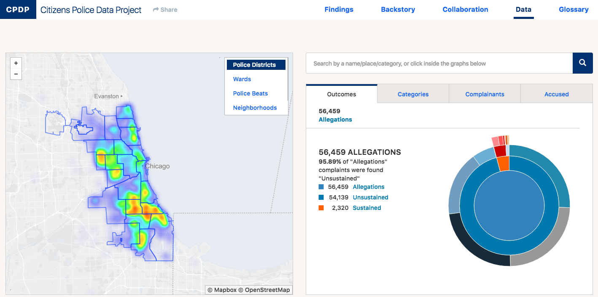
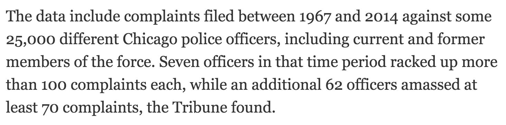
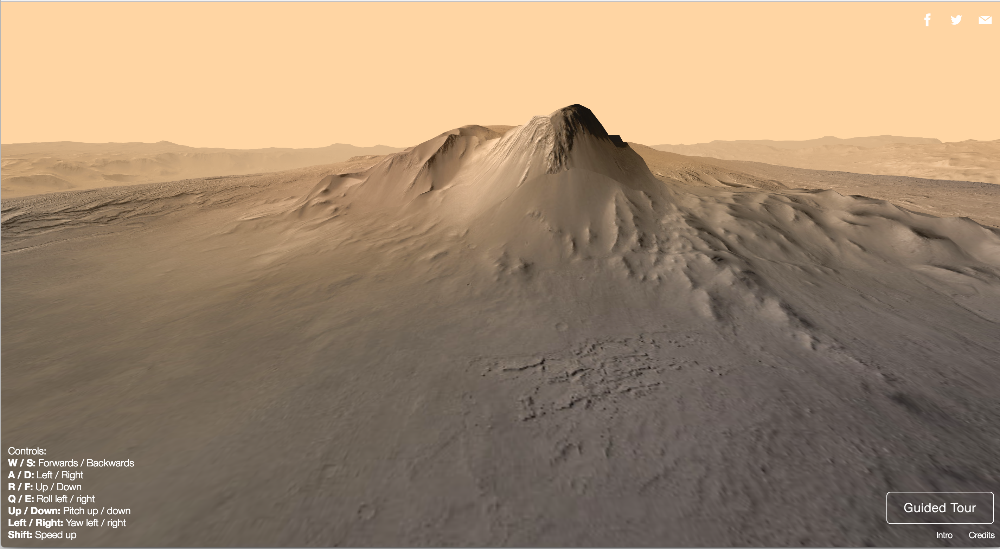

Tools for data and visual journalism
====================================

"data journalism"
-----------------

These are my definitions, and they're fluid.

Data journalism = journalism based on a quantitative analysis of records, documents or other information about events.

Data could be:

    * [Crime incident reports fromt he city data portal](https://data.cityofchicago.org/Public-Safety/Crimes-2001-to-present/ijzp-q8t2)
    * [Satelite imagery of estate lawns](https://www.revealnews.org/article/who-is-the-wet-prince-of-bel-air-here-are-the-likely-culprits/)
    * [Details of police shooting victims hand-entered from news reports](https://www.washingtonpost.com/policeshootings/)
    * What are your examples of data?

The journalism from it could look like ...

Maps and charts

From [Citizens Police Data Project](https://cpdb.co/data/AQj3yD/citizens-police-data-project).

From 

A line in a print story

From [Over 125K complaints against more than 25K Chicago cops](http://www.chicagotribune.com/news/watchdog/ct-chicago-police-complaints-met-20161013-story.html).

A virtual reality experience

From [Discovering Gale Crater](http://graphics.latimes.com/mars-gale-crater-vr/).

What are your examples of journalism rendered from data?

Other terms: data-driven journalism, precision journalism

"visual journalism"
-------------------

"visual journalism" = stories, or parts of stories, told primarily through perceiving sensory dimensions, rather than words and language

Again, this could look like maps and charts

From [Citizens Police Data Project](https://cpdb.co/data/AQj3yD/citizens-police-data-project).

But what about ...

From [In the Chicago Police Department, If the Bosses Say It Didn’t Happen, It Didn’t Happen](https://theintercept.com/2016/10/06/in-the-chicago-police-department-if-the-bosses-say-it-didnt-happen-it-didnt-happen/).

Or ...

<iframe src="https://player.vimeo.com/video/118358642" width="640" height="360" frameborder="0" webkitallowfullscreen mozallowfullscreen allowfullscreen></iframe>

From [Two Trains: Sonification of Income Inequality on the NYC Subway](https://datadrivendj.com/tracks/subway)

We'll focus on tools that sit in the intersection of data and visual journalism.

Tasks before tools
------------------

So today we're going to talk about journalism tools. But, often the way we're taught and learn tools is as a series of steps.  We can memorize these steps, but they don't always translate to different tools.  Memorizing steps also doesn't let us think critically about whether a tool is getting the job done.  In the case of journalism this means telling part of our story.

Instead, I want to focus on data and visual journalism tasks rather than specific tools, though we'll get to try out a few tools. When I present a tool, I'll try to offer alternatives that provide different ways to accomplish the same tasks. 

Iterate
-------

Often it's easy to think of tools that visualize data as things we employ in the final steps of producing a piece of journalism.  This is wrong.  I want to encourage you to try out the tools we'll talk about today at every step of reporting.  We'll focus on getting meaning from these visuals rather than their elegance.  We can always polish the visuals later.  Visualizing data early helps you think about what your reporting in different ways. It also tests different visual forms.  If a particular form isn't helpful to you as you're reporting, it probably won't be helpful to your audience either.

Task: quickly organize and summarize information
------------------------------------------------

Tool: pencil and paper 

Task: Examine spatial trends
----------------------------

Tool: Carto

Other tools:

* Mapbox
* QGIS
* ogr2ogr

Task: List and rank numbers
---------------------------

Tool: ??? (some kind of table builder)

Task: group and compare numbers
-------------------------------

Tool: Google spreadsheets 

Other tools:

* R + ggplot2
* Python + Pandas + seaborn
* Tableau
* Excel
* LibreOffice calc
